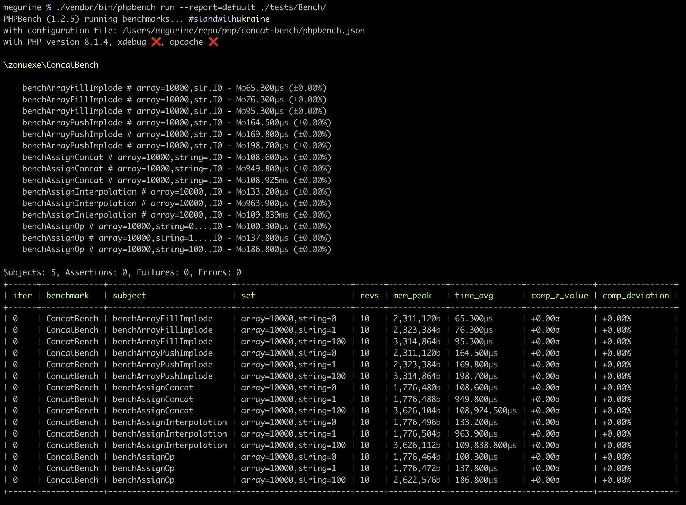

# concat-benchmark

[PHPでの文字列追記は結合(.)より結合代入(.=)が圧倒的に早い - Qiita](https://qiita.com/hoogee/items/2a3b8d49b67c99de7df9)にインスパイヤされました。

## 実行方法

```
./vendor/bin/phpbench run --report=default ./tests/Bench/
```

## 結果

### M1 Mac (MacBook Pro 14 inch, 2021)



### M1 Mac (MacBook Pro 14 inch, 2021) + OPCache


